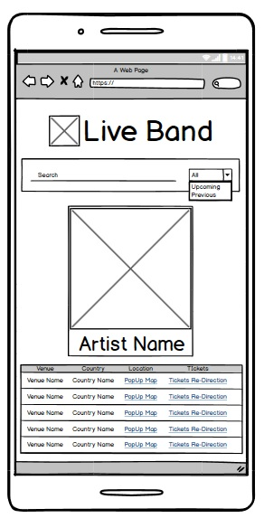

# Interactive Frontend Development Milestone Project
## Live Band

This website is connected to two API's, the first one is the [Bandsintown REST API](https://www.bandsintown.com/) , which is use to fetch the information which will be displayed on a table. The second API used in this project is [Google Maps API](https://cloud.google.com/maps-platform/).

### Purpose
The purpose of this project is to show the skills gain through out the course at this point and during the development of this project.
In this project you will be able to find available shows/events from your favorite band or artists. As a single page application, it will load all the information without the need to reload all the webpage again, updating the information in real time.
The information shown will be number, represented with a #, venue name, city, country, location, and tickets link, represented with a globe and a ticket icon respetively.
Connecting the application with a google maps API, the end user will be able to see in a pop-up map where the venue is located.
This is a non-profit project, reason why each ticket link targets to a new tab/window to [bandsintown](https://www.bandsintown.com/) artist link.

### Technologies
* HTML
* CSS
* JS

### Libraries
* Handlebars
* Colorbox
* Lodash
* Materialize
* jQuery

### API's
* Google Maps
* Bands in town API

### UX with Responsive design
In this case, [Materialize](https://materializecss.com/) was used insted of [Bootstrap](https://getbootstrap.com), no reason in particular, simply testing something new.

For the icons [icons8](https://icons8.com/) was the option for their desings and for the fonts, from [Google Fonts](https://fonts.google.com), [pacifico](https://fonts.google.com/?query=pacifico) and [Source Code Pro](https://fonts.google.com/specimen/Source+Sans+Pro).

In the tablet/desktop version, is easy to see all the rows of the table.

| # | Venue | City | Country | Location | Tickets |
|---|-------|------|---------|----------|---------|

In the mobile version, the table change to make it easy to read on small devices such as smartphones, keeping location due to it is a small icon and when clicked pop-up the map where the venue is located, and last the ticket link which openes a new tab on the browser to get the tickets of the event.

| Venue | Country | Location | Tickets |
|-------|---------|----------|---------|

### Deployment
The project was developed using Visual Studio Code and for version control used git and Github Desktop, a github desktop aplication which makes committing and pushing the changes easier to github where the peoject is hosted.
This application is live and hosted in GitHub pages, deployed from the master branch. The landing page is the index.html file in order to make it live. Everytime a change is being done and commit to the project it will be reflected.

### Testing
In the working project place, the application was tested on Chrome desktop version, changing the view port size using the developers tools of the web browser, also chrome web version on a Samsung Galaxy Note 10 and a Samsung Galaxy Note 8. 

Sharing the project's link and asking friends to test and share their thougths, has been good to understand how they would interact with the application and how it will behaive on their devices, making the changes on time to test again. Considering that the straight devices they will testing it is a smartphone, the project target was to work perfect on a mobile phone/smartphone. 

### Features
#### Fueatures left to implement
Implementing Spotify in this project was complicated with my knowledge gain at this point, for that reason I decided to left it for as a feature implementation to complement the project.

On the country row of the table will be added a filter, to be able to display just the countries the end user is interested on.

### Credits
Special thanks to [Bandsintown](http://corp.bandsintown.com) for letting me use thier API and achive this project.